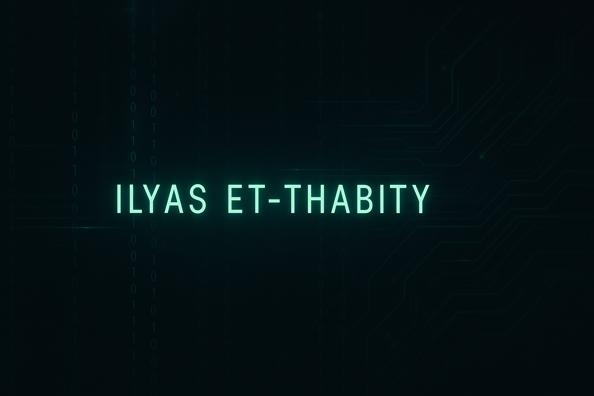

<h1 align="center">👋 Hi, I'm Ilyas Et-Thabity (Dostofine)</h1>

  

  <b>Applied Computer Science Student @ Université Chouaib Doukkali (UCD), El Jadida</b> 
  Founder & President of <b>UCD-CYBERFORCE</b> | Cybersecurity | Linux | C | Python

---

## 🧑‍💻 About Me

I’m a first-year student in **Applied Computer Science** at **UCD El Jadida (Morocco)**.  
My interests revolve around **cybersecurity**, **Linux systems**, **networking**, and **low-level programming**.

Outside of classes, I spend my time:

- 🔍 Exploring Linux internals and terminals  
- 🐍 Writing Python tools for automation and cybersecurity  
- 🧵 Building C programs and understanding memory, pointers, and system calls  
- 🧩 Leading **UCD-CYBERFORCE**, our university’s cybersecurity club  
- 📡 Running workshops, CTF sessions, and learning events for beginners  

---

## 🧰 Skills & Tools

### **Languages**
- C  
- Python  
- Bash  

### **Operating Systems**
- Linux 
- Windows (when needed)  

### **Developer Tools**
- Git, GitHub  
- VS Code / VSCodium  
- Vim & Neovim
- Linux system administration  

### **Core Concepts**
- Algorithms & Data Structures  
- Networking fundamentals  
- Cybersecurity basics (CTF, reconnaissance, encryption, etc.)  
- Packet analysis & system utilities  

---

## 🧨 UCD-CYBERFORCE (My Cybersecurity Club)

I’m the **founder and president** of **UCD-CYBERFORCE**, a student-led cybersecurity club at UCD.

We focus on:

- 🐧 Linux for security  
- 🧩 CTF training (OverTheWire, PicoCTF, etc.)  
- 🌐 Networking & packet analysis  
- 🛡 Blue team vs Red team mindset  
- 👥 Workshops, Discord training, and beginner-friendly sessions  

If you're a student at UCD, feel free to connect and join us.

## 📈 GitHub Stats

  
  

## 🌐 Connect With Me

  
  
  

If you want to collaborate on a project, join **UCD-CYBERFORCE**, or just chat about Linux & cybersecurity, feel free to contact me!

---

## 🚀 What’s Next?

Here’s what I’m currently working on:

- 📡 Going deeper into **network security** (IDS/IPS, secure protocols)  
- 🧠 Learning **systems & kernel programming in C**  
- 🐞 Studying **exploit development** & **reverse engineering**  
- 🤝 Preparing to contribute to open-source security projects  
- 🧩 Building tools for internal club training and CTF practice  

Stay tuned for new repos, tutorials, and club activities! ✨

---
